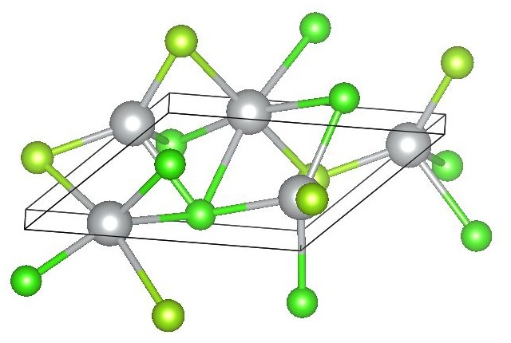
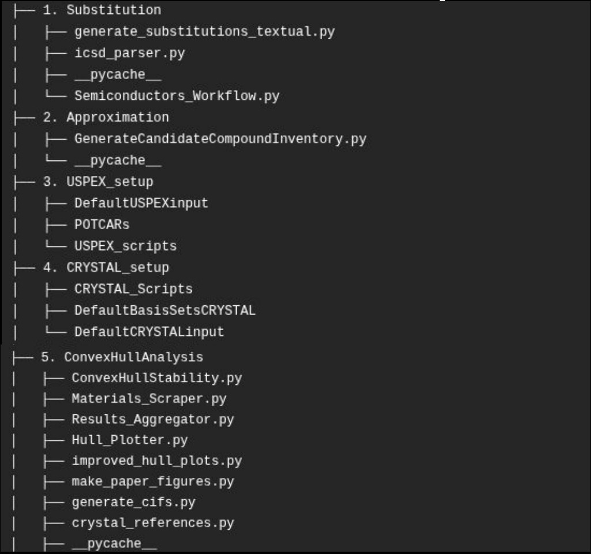
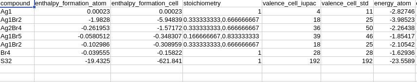
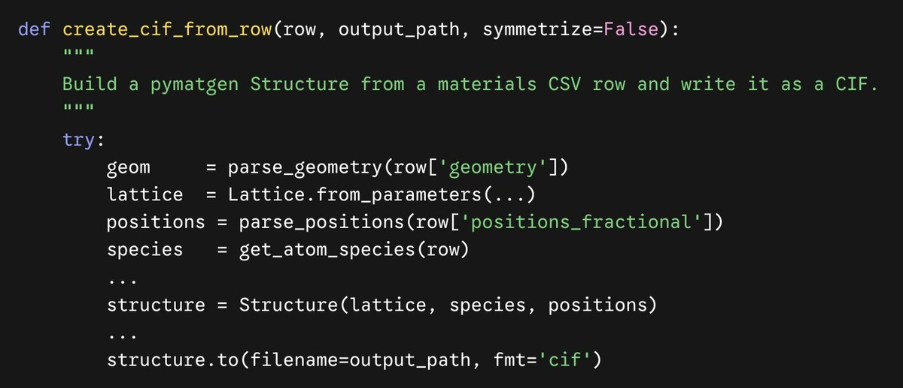
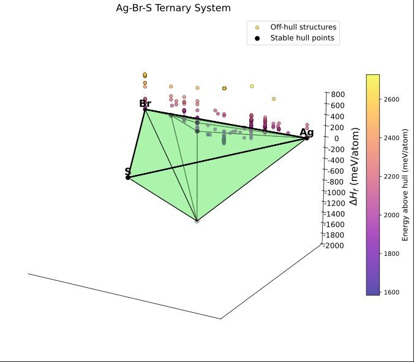

## NSF Undergraduate Researcher, Michigan State University {#msu-research}

```{=html}
<div class="project">
  <div class="project-img">
    
  </div>
  <div class="project-text">
    <p><strong>Department of Materials Engineering, East Lansing, MI</strong> &nbsp;|&nbsp; June 2026 – September 2026</p>
    <p><strong>The lab's project:</strong><br>
      SALSA (Substitution, Approximation, evoLutionary Search, Ab initio calculations) is a
      computational workflow from Prof. Jose L. Mendoza-Cortes's group that discovers new
      semiconductor materials. Instead of a brute-force search, it recombines known compounds to
      predict new candidates, with applications like photocatalytic water-splitting: using light to
      split water into hydrogen and oxygen.</p>
    <p><strong>My contribution:</strong><br>
      Together with Karina Shih, I added a new final step to SALSA: an automated convex-hull stability
      analysis that checks whether the materials SALSA predicts are thermodynamically stable. Building on
      starting scripts from my mentor, Marcus Djokic, which contained much of the underlying chemistry,
      we built a new <code>ConvexHullAnalysis</code> module of Python scripts that pulls reference data from
      AFLOW and Materials Project, finds the stable compounds, prepares them for CRYSTAL23 calculations
      on the HPCC, and collects and plots the results. It replaced about 20 separate scripts and cut
      manual analysis from days to hours, and our final hull plots matched Marcus's reference results.</p>
    <p><strong>Skills:</strong><br>
      Python, pandas, pymatgen, Materials Project API, AFLOW, CRYSTAL23, High-Performance Computing,
      Convex-Hull Stability Analysis, Research Software Development</p>
    <a href="https://arxiv.org/abs/2310.00118" target="_blank" class="btn-link">Read the SALSA Paper (arXiv)</a>
  </div>
</div>

<details class="more">
  <summary></summary>
  <div class="detail-grid">
    <div>
      <strong>A New Pipeline Step</strong>
      
      <p>Steps 1–4 of SALSA already existed. Step 5, <code>ConvexHullAnalysis</code>, holds the
        scripts Karina and I wrote.</p>
    </div>
    <div>
      <strong>Scraping &amp; Stability Screening</strong>
      
      <p><code>Materials_Scraper.py</code> gathers energy, composition, and crystal-structure data for
        each candidate's chemical system from AFLOW and Materials Project.
        <code>ConvexHullStability.py</code> cleans that data, computes formation energies, builds a
        ternary convex hull, and outputs only the stable compounds (above).</p>
    </div>
    <div>
      <strong>Crystal Structures for DFT</strong>
      
      <p><code>generate_cifs.py</code> rebuilds each stable (or near-stable) compound's crystal
        structure and writes it as a symmetrized CIF file, ready for CRYSTAL23 optimization,
        frequency, and single-point calculations on the HPCC.</p>
    </div>
    <div>
      <strong>Results &amp; Hull Plots</strong>
      
      <p><code>Results_Aggregator.py</code> collects the CRYSTAL23 energies into one dataset, and
        <code>Hull_Plotter.py</code> draws ternary and quaternary hulls comparing SALSA candidates with
        AFLOW reference materials, across OPT2, SP, enthalpy, and Gibbs free energy. Our finished plots
        matched Marcus Djokic's reference results, confirming the new step works correctly. Shown: an
        Ag-Br-S hull from Marcus's original scripts.</p>
    </div>
  </div>
</details>

<p><strong>Acknowledgments:</strong> A special thank you to my mentor, Marcus Djokic. His starting
  scripts contained much of the chemistry behind this step and gave Karina and me a strong foundation
  to build our scripts from. Thank you as well to Prof. Jose L. Mendoza-Cortes and Karina Shih. I'm
  grateful to all three for letting me contribute to their research and for a great head start and
  learning opportunity.</p>
<p style="font-size: 0.85rem; opacity: 0.75;">SALSA is described in: S. M. Stafford, A. Aduenko,
  M. Djokic, Y.-H. Lin, and J. L. Mendoza-Cortes, "Transforming materials discovery for artificial
  photosynthesis: High-throughput screening of earth-abundant semiconductors," arXiv:2310.00118, 2023.</p>
```

---

## Student-Athlete, CMS Men's Tennis {#tennis}

```{=html}
<div class="project">
  <div class="project-img">
    
  </div>
  <div class="project-text">
    <p><strong>Claremont, CA</strong> &nbsp;|&nbsp; August 2024 – Present</p>
    <p>I compete in NCAA Division III varsity tennis for CMS Men's Tennis, a top-5 nationally ranked
      team. I balance 20+ hours a week of training and travel with a rigorous engineering course load.</p>
  </div>
</div>
```
