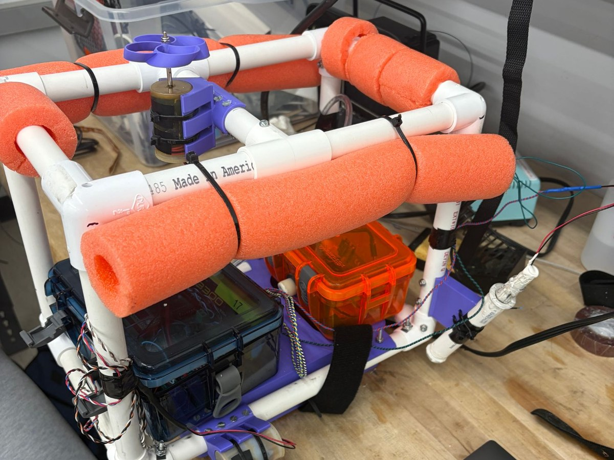
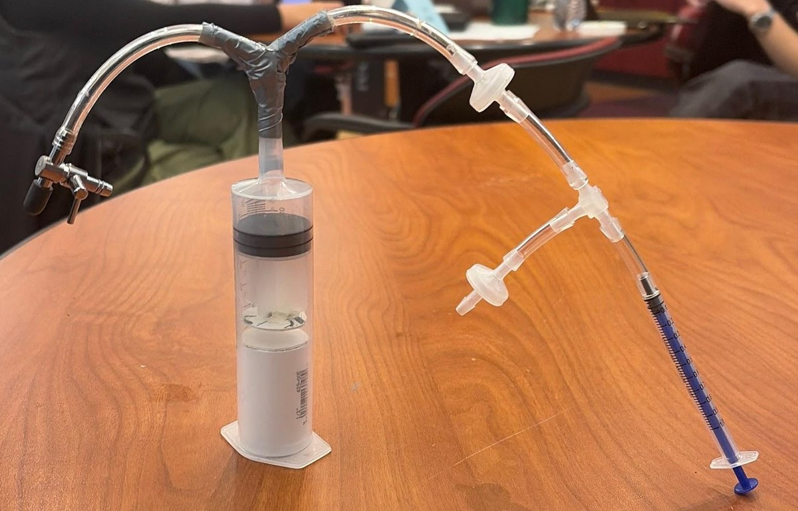

Welcome to my portfolio! I'm a junior Engineering major at
[Harvey Mudd College](https://www.hmc.edu), graduating in May 2028. My work spans
hardware design, CAD and fabrication, sensors, and embedded imaging systems. This
past summer I was an NSF undergraduate researcher at Michigan State University,
building Python tools for a lab pipeline that screens semiconductors for
photocatalytic water-splitting.
Outside of engineering, I compete on the CMS Men's Tennis team.
Check out my projects below!

---

```{=html}
<!-- Project cards: copy one <a class="proj-card"> block per project.
     href points to a page, optionally with #section-id to jump to that section.
     To use a real photo, change src to e.g. images/projects/e80/main.jpg -->
<div class="proj-grid">
  <a href="experience.html#msu-research" class="proj-card">
    
    <div class="proj-label">
      <p class="proj-course">Research · Michigan State</p>
      <p class="proj-name">Convex-Hull Stability Screening for SALSA</p>
    </div>
  </a>

  <a href="projects.html#e80-seafloor-mapping" class="proj-card">
    
    <div class="proj-label">
      <p class="proj-course">E80</p>
      <p class="proj-name">3D Seafloor Mapping Robot</p>
    </div>
  </a>

  <a href="projects.html#e4-hydrogel-tester" class="proj-card">
    
    <div class="proj-label">
      <p class="proj-course">E4</p>
      <p class="proj-name">Boba Busters: Hydrogel Compression Tester</p>
    </div>
  </a>
</div>

<!-- Resume: to update it, replace images/Resume.pdf with the new file (same name). -->
<div style="text-align:center; margin: 1.5rem 0 1rem;">
  <a href="images/Resume.pdf" target="_blank" class="btn-link">Open Full Resume in New Tab</a>
</div>
<div style="text-align:center;">
  <iframe class="resume-frame" src="images/Resume.pdf"></iframe>
</div>
```
