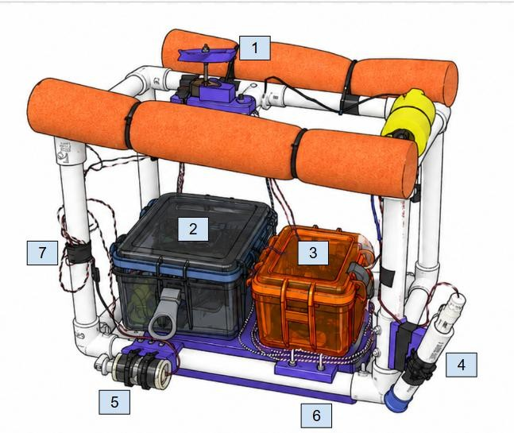
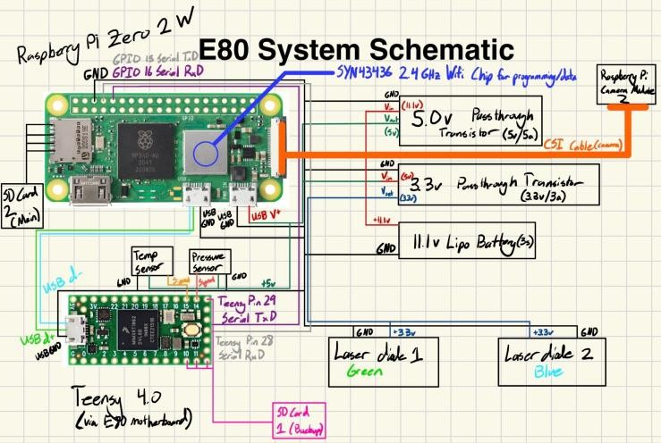
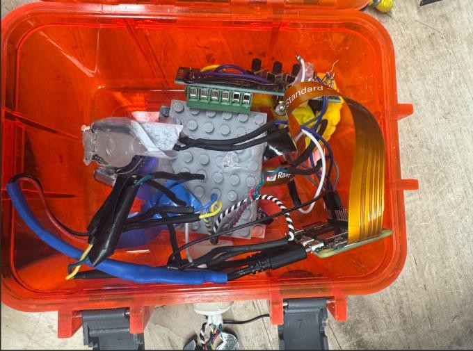
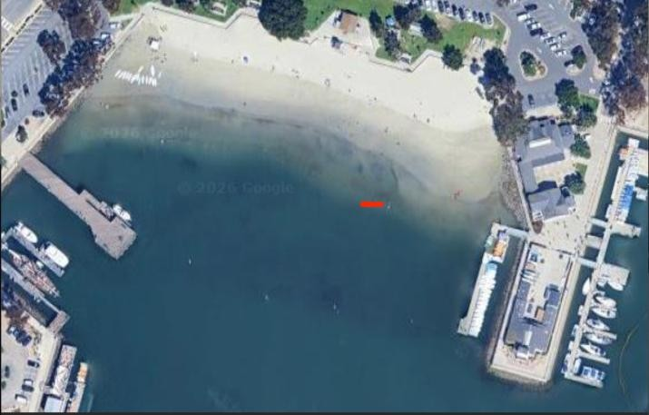
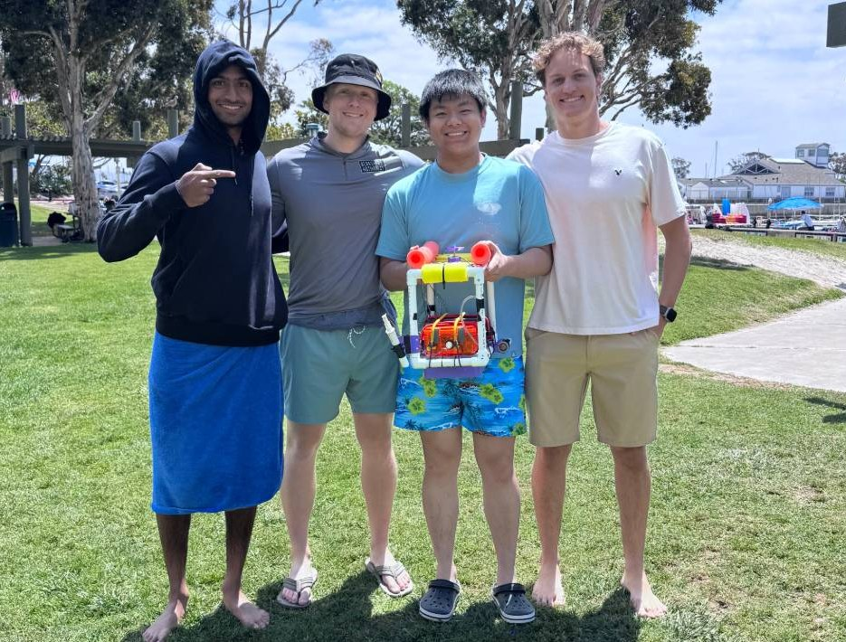
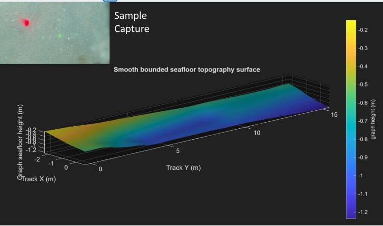
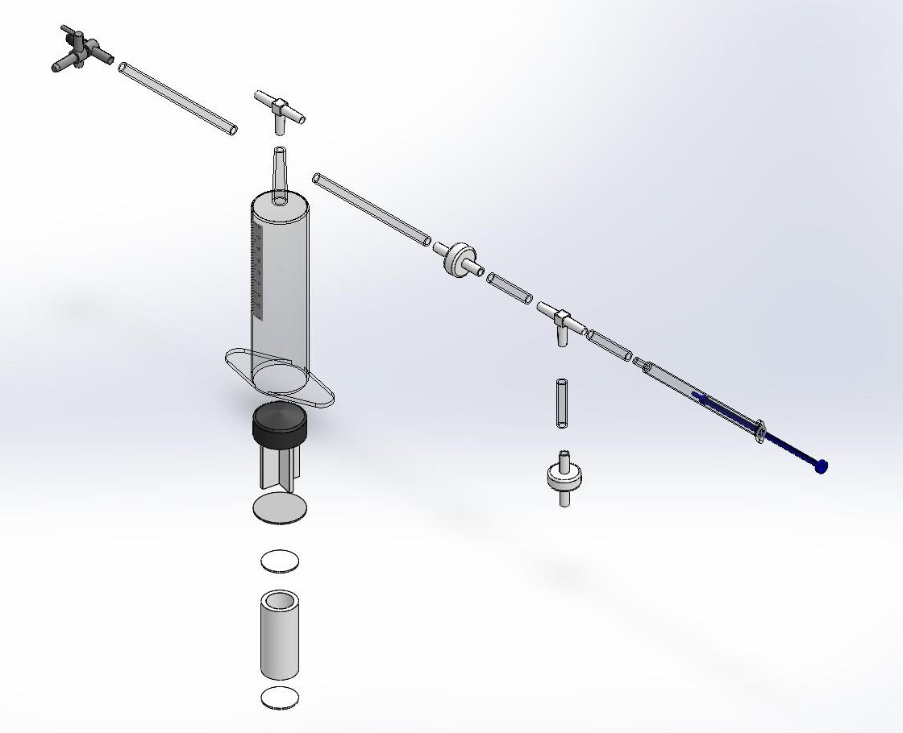
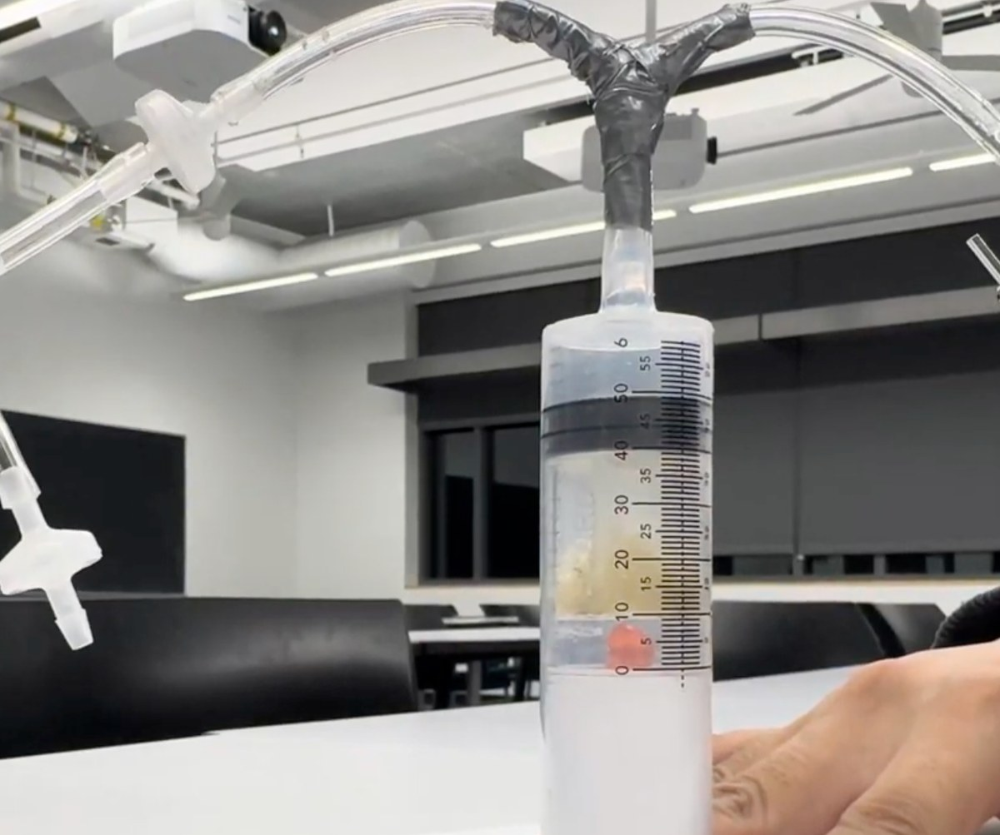
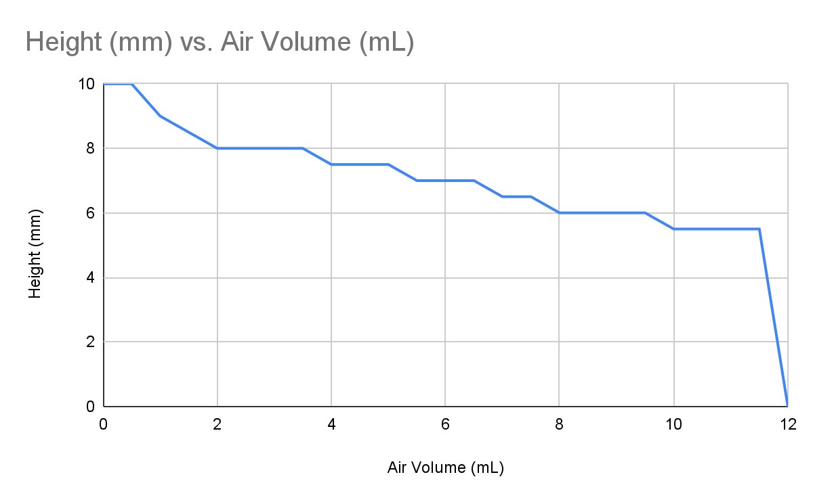

<!-- To add a project: copy everything from a "## Heading {#id}" line down to the
     next "---", then change the heading, id, image paths, and text. The {#id} is
     the link anchor used by the home page cards (e.g. projects.html#e80-seafloor-mapping).
     To use a real photo, change src to e.g. images/projects/e80/main.jpg -->

## Low-Cost 3D Seafloor Mapping Robot {#e80-seafloor-mapping}

```{=html}
<div class="project">
  <div class="project-img">
    
  </div>
  <div class="project-text">
    <p><strong>Role:</strong> Project Lead, Harvey Mudd E80 &nbsp;|&nbsp; January 2026 – June 2026</p>
    <p><strong>Overview:</strong><br>
      Seafloor mapping usually relies on sonar from research ships, which can cost around $35,000 a day.
      I led a four-person team that built an autonomous underwater vehicle (AUV) to map shallow seafloor
      terrain with lasers and a camera instead, on a $50 budget. A Raspberry Pi camera captures up to
      4 photos per second of a blue laser dot and a green laser grid. Triangulating where those points land
      gives distance and slope, which we turned into a 3D topographic map in MATLAB. The robot also logs
      water temperature and pressure.</p>
    <p><strong>Skills:</strong><br>
      Team Leadership, Laser Triangulation, Camera Calibration, Raspberry Pi, Teensy, Op-Amp Sensor Circuits,
      MATLAB, Waterproofing, Field Testing</p>
  </div>
</div>

<details class="more">
  <summary></summary>
  <div class="detail-grid">
    <div>
      <strong>Mechanical Design</strong>
      
      <p>A PVC frame with foam floats, one vertical propeller for diving, and two horizontal propellers
        for steering. The blue box holds the sensor circuit board and battery, and the orange box holds the
        Pi, camera, and green laser. A 3D-printed ballast holder keeps the weights from shifting, and the
        blue laser sits in its own angled housing for depth triangulation.</p>
    </div>
    <div>
      <strong>Electronics</strong>
      
      <p>A Teensy 4.0 logs temperature (thermistor) and pressure (MPX5700) through op-amp circuits that
        we calibrated in the lab. A Raspberry Pi Zero 2 W runs the camera and lasers, all powered by an
        11.1 V LiPo battery.</p>
    </div>
    <div>
      <strong>Laser-Camera Module</strong>
      
      <p>A waterproof box holds the Pi, camera, and a green laser with a diffraction grating that spreads
        it into a grid. We chose green and blue lasers because those wavelengths travel farthest through
        water. We calibrated the camera against a flat surface tilted from 0° to 45° to convert pixels to
        meters.</p>
    </div>
    <div>
      <strong>Deployment</strong>
      
      <p>After test runs at a lake and a pool, we deployed at Dana Point, CA, on April 25, 2026 (path in
        red). Pool testing revealed a leak in the camera box at 1.5 m, so we reprogrammed the robot to
        cruise just below the surface. We also fixed a thrust imbalance between the two side motors that
        made the robot drift in circles.</p>
    </div>
    <div>
      <strong>Launch Day</strong>
      
      <p>Our team with the robot at Dana Point after the final deployment.</p>
    </div>
    <div>
      <strong>Results</strong>
      
      <p>Our MATLAB map of a roughly 15 m track showed the seafloor reaching about 1.2 m deep. Temperature
        read about 6 °C high, likely from Raspberry Pi heat near the sensor board. Next steps: a laser that
        doesn't overheat, and GPS to tag each photo's location.</p>
    </div>
  </div>
</details>
```

---

## Boba Busters: Hydrogel Compression Tester {#e4-hydrogel-tester}

```{=html}
<div class="project">
  <div class="project-img">
    
  </div>
  <div class="project-text">
    <p><strong>Role:</strong> Project Lead, Harvey Mudd E4 &nbsp;|&nbsp; September 2025 – December 2025</p>
    <p><strong>Overview:</strong><br>
      A Harvey Mudd engineering professor who runs science outreach at local elementary schools asked
      our four-person team for a hands-on way to teach 4th and 5th graders how hydrogels deform. Our
      device, Boba Busters, uses a small 1 mL syringe to pump air into a clear 60 mL syringe, pushing a
      plunger down onto a piece of popping boba (a cheap, food-safe hydrogel). Students track how much
      air they've pumped in and read the boba's height off a millimeter scale until it pops.</p>
    <p><strong>Skills:</strong><br>
      SolidWorks, Design for Cost, Prototyping, Experimental Design &amp; Testing, Data Analysis, STEM Outreach</p>
    <a href="images/projects/e4/Final_Prototype_Memo.pdf" target="_blank" class="btn-link">Read the Final Prototype Memo (PDF)</a>
  </div>
</div>

<details class="more">
  <summary></summary>
  <div class="detail-grid">
    <div>
      <strong>Design</strong>
      
      <p>Modeled the full assembly in SolidWorks. Every part is off-the-shelf from Home Depot or Amazon
        (syringes, check valves, vinyl tubing, and a ½-inch PVC coupling as the boba stand), and a unit
        can be built with just scissors, tape, and hot glue, so teachers can make their own. The design
        is modular and waterproof: parts swap out easily, and the whole unit can be rinsed off.</p>
    </div>
    <div>
      <strong>Testing</strong>
      
      <p>Ran three trials, pumping air until the boba popped. It took 12.5, 12, and 13 mL of air, a
        relative standard deviation of 4%, which met our "good consistency" target. Five first-time
        users rated ease of use 2.8 out of 3.</p>
    </div>
    <div>
      <strong>Result</strong>
      
      <p>Example data a student would collect: the boba compresses gradually, then pops. The final
        cost was $11.26 per unit, under the $15 budget. Next steps: lubricate the plunger to reduce
        friction, and label the release valve, which confused one tester.</p>
    </div>
  </div>
</details>
```

---
